:toc:
:toc-title: ОГЛАВЛЕНИЕ:

Тема работы: Разработка датчика бесконтактного измерения температуры с передачей параметров USART.

Работу выполнили: Думановский А.А., Чирков А.М., Ильин С.С.

= Задание на курсовой проект

Для разработки должна использоваться отладочная плата XNUCLEO-F411RE.

Питание платы должно быть автономным и подаваться с солнечный батарей.

Программное обеспечение дслжно измерять температуру:

* Период измерения должен быть 100 ms.
* К измеренной температуре далжен быть применен цифровой фильтр.
* Для измерения температуры должен испельзсваться датчик инфрарасный датчик температуры.

Вывод значений температуры дслжен прсизводиться черезинтерфейс USARТ2:

* Период нывода информации черезинтерфейс USART2 должен осуществляться раз в З секунды.
* фсрматвывода: "Температура: "XXX.XX [Units].

Архитектура должна быть представлена в виде UML диаграмм в пакете Star UML.

Приложение дслжно быть написано на языке C+ сиспальзование компилятора ARM 8.40.2.

При разработке должна использоваться Операционная Система Реального Времени FreeRTOS и С++ обертка над ней.

= Анализ требований

== Плата XNUCLEO-F411RE

XNUCLEO-F411RE – это отладочная плата от компании Waveshare с поддержкой Arduino, которая позволит изучить возможности микроконтроллера STM32F411RET6 на базе ядра Cortex-M4.

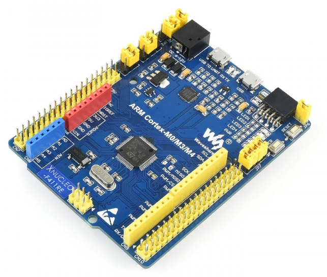

Технические характеристики микроконтроллера STM32F411RET6:

* ядро: ARM 32-Бит Cortex-M4;
* рабочая частота: 100МГц;
* рабочее напряжение: 1.7...3.6В;
* память: 512кБ Flash, 128кБ SRAM;
* интерфейсы: 1 x SDIO, 1 x USB 2.0 FS, 5 x SPI or 5 x I2S, 3 x USART, 3 x I2C;
* АЦП/ЦАП: 1 x АЦП (12 Бит, 16 каналов).
* SPX3819M5: регулятор напряжения 3,3 В;
* AMS1117-5.0: регулятор напряжения 5,0 В;
* CP2102: преобразователь USB в UART;
* разъем Arduino: для подключения щитов Arduino;
* интерфейс ICSP: Arduino ICSP;
* USB TO UART: для отладки;
* разъем USB: интерфейс связи USB;
* интерфейс SWD: для программирования и отладки;
* индикатор Rx/Tx последовательного порта;
* кристалл 8 МГц;
* кристалл 32,768 кГц.

== Инфракрасный датчик температуры

image::image-1.png[]

=== Принцип измерения
Для бесконтактного инфракрасного модуля измерения температуры поле зрения (FOV) является очень важным понятием.
FOV определяется 50% сигналом излучения, принимаемым термоэлектрической батареей. И это связано с осью шпинделя датчика.
Обнаруженная температура представляет собой средневзвешенное значение температуры объекта, обнаруженной в FOV.
Таким образом, значение является наиболее правильным, пока объект покрывает весь FOV.

=== Характеристики
* Мощность: 3,3 В ~ 5 В.
* Диапазон измерения (площадь): 40°C ~ 85°C.
* Диапазон измерения (объект): -70°C ~ 380°C.
* Разрешение: 0,02°C.
* Точность: ±0,5°C (0~50°C).

=== РАСПИНОВКА
|====

|PIN |Описание
|VCC
|3,3 В/5 В
|GND
|Земля
|SDA
|Ввод данных I2C
|SCL
|Тактовый контакт I2C
|====

=== Протокол связи
Этот датчик имеет цифровой выход PWM и SMBus (шина управления системой). В этом документе мы вводим только связь SMBus. SMBus – это двухпроводной интерфейс, основанный на принципе I2C.
Стартовый сигнал: SCL имеет ВЫСОКИЙ уровень, SDA переключается с ВЫСОКОГО на НИЗКИЙ, начинается передача данных.

Сигнал остановки: SCL имеет высокий уровень, SDA переходит от низкого уровня к высокому, передача завершена.

image::image-2.png[]

ACK: Каждый раз, когда Master (Slave) получает 8-битные данные от Slave (Master), он отправляет ACK обратно отправителю, чтобы сообщить, что данные были успешно переданы, удерживая SDA неактивным в течение всего периода SCL.

image::image-2022-03-03-22-27-29-983.png[]
image::image-2022-03-03-22-27-40-076.png[]

== Интерфейс SMBus

=== Чтение времени SMBus

image::image-2022-03-03-22-28-23-809.png[]

1. MD отправит сигнал Start, затем 8-битные данные на SD. Данные объединяются с 7-битным адресом SD и битом операции «Чтение». SD ответит на ACK после получения.
2. MD отправляет SD 8-битную команду, SD ответит ACK.
3. MD отправляет сигнал «Пуск» и 8-битные данные, которые снова объединяются с 7-битным адресом SD и битом операции «Чтение». SD ответит на ACK и отправит данные в своем регистре на MD после их получения.
Примечание. MD должен отправлять ACK каждый раз, когда получает байт. Если MD получает PEC, он посылает сигнал Stop для прекращения связи после ACK.

=== Время записи SMBus

image::image-2022-03-03-22-28-45-693.png[]

1. MD отправляет сигнал «Пуск» и отправляет 8-битные данные, которые объединяются с 7-битным адресом SD и битом операции «Запись» в SD. SD ответит на сигнал ACK.
2. MD отправляет 8-битную команду на SD и получает ACK от SD.
3. MD сначала отправляет младшие байты данных, после получения ACK он отправляет старшие байты. Получите ACK, затем отправьте байты PEC.
4. В конце отправьте сигнал «Стоп», чтобы остановить связь.

=== Настройка I2C

1) Подача тактирования I2C:
Установка бита I2С в регистре АРВ1.

[source, c++]
RCC::APB1ENR::I2C1EN::Enable::Set();

2)	Включаем режим SMBus CR1.

В модуле I2C
Бит 1 SMBUS: режим SMBus
0: режим I2C
1: режим SMBus

3)	Включаем распознавания устройства SMBus
Бит 3 SMBTYPE: Тип SMBus.

0: Устройство SMBus

1: SMBus Host

SMBus Адрес устройства по умолчанию распознается, если SMBTYPE=0

Адрес хоста SMBus распознается, если SMBTYPE=1

4)	Подключаем Standartmodдля установления частоты 2 МГц

Бит 15 F/S: I2C master mode selection.

0: Sm mode I2C.

1: Fm mode I2C.

5)	Выставляем частоту периферийного устройстваI2C_CR2

Биты 5:0 FREQ[5:0]: Тактовая частота периферийного устройства.

Выбирается на основе доступных частот ИК датчика 0b010000: 16МГц.

6)	Настройка регистра таймеров I2C_CCR

Бит 15 устанавливается в 0, т.к. не выполняется отношение Tlow к Thigh как 1/2.

Из DataSheet по ИК датчику MLX90614 можно определить Thigh=45..55мкси Tlow=27..33 мс.

image::image-2022-04-22-21-57-19-873.png[]

Бит 11 регистр тайминга CCR.

TPCLK1 – период APB1, получаемый по формуле 1/f, где f=16MHz.

TPCLK1=0,0625мкс.

Используя формулу:

image::image-2022-04-22-21-58-15-306.png[]

И, взяв Thigh=50, определим CCR= 250(FA).

Tlow= 9 мс.

7)	Выставляем бит макс нарастанияI2C_TRISE

TRISE [5:0]: Максимальное время нарастания в режиме Fm/Sm (режим ведущего устройства).

Эти биты должны обеспечивать максимальную длительность петли обратной связи SCL в режиме ведущего устройства.

Так как особых требований нет возьмём SCLhigh = 1000 нс.
Используя формулу:

image::image-2022-04-22-22-00-10-481.png[]

1/0,0625=16+1, тогда TRISE 17h.

8)	Настройка портов
Для корректной работы интерфейсови портов переведём B8 (SCL), B9 (SDA) в альтернативный режим.

[source, c++]
GPIOB::MODER::MODER8::Alternate::Set();
GPIOB::MODER::MODER9::Alternate::Set();

Установим альтернативные функции регистраAFRHSCLиSDA:

[source, c++]
GPIOB::AFRH::AFRH8::Af4::Set();
GPIOB::AFRH::AFRH9::Af4::Set();

В регистре OTYPER, отвечающем за выводы, настроим портыB8и B9используя команду OutputOpenDrain.
Выход с открытым стоком. Функционально аналогичен выходу с открытым коллектором.
При низком логическом уровне замыкает вывод на землю, при высоком – бросает в воздухе.

[source, c++]
GPIOB::OTYPER::OT8::OutputOpenDrain::Set();
GPIOB::OTYPER::OT9::OutputOpenDrain::Set();

Установим подтяжку к единице на B8, B9 портах, т.к. без неё будет разрыв.

[source, c++]
GPIOB::PUPDR::PUPDR8::PullUp::Set() ;
GPIOB::PUPDR::PUPDR9::PullUp::Set() ;

image::image-2022-04-22-22-05-37-559.png[]

9)	Генерируем старт

10)	Алгоритм считывания
Инициация передачи I2C:

[source, c++]
I2C1::CR1::START::Enable::Set();

Проверить бит SB пока он не станет = 1 (установился ли стартовый бит).

[source, c++]
while(I2C1::SR1::SB::Value0::IsSet())
{
}

Получение данных с регистра SR1.

[source, c++]
I2C1::SR1::Get();

Включение ACK (бит подтверждения – если мастер записывает в SLAVE, то SLAVE долженкаждый
байт подтверждать сигналом ACK. Если слейв отправляет данные мастеру,
то мастер должен на все байты отвечать ACK, кроме последнего — это будет сигналом,
что больше отправлять данные не требуется) для модуляI2C.

Данный бит необходимо установить сразу. Что бы принять ответ от подчинённого устройства.

[source, c++]
I2C1::CR1::ACK::Acknowledge::Set();

I2C_DR нужен для отправки данных и их приёма,
туда передаётся адрес устройства (ИК-датчика) (0 если запись, 1 если чтение).

[source, c++]
I2C1::DR::Write(0x00);

Дождаться бита ADDR (адрес отправлен и воспринят slave-устройством) в SR1, пока не станет =1.

[source, c++]
while(I2C1::SR1::ADDR::Value0::IsSet())
{
}

Получение данных с регистра SR1, SR2.

[source, c++]
I2C1::SR1::Get();
I2C1::SR2::Get();

Далее необходимо записать адрес регистра, в котором хранятся значения температуры.

image::image-2022-04-22-22-08-21-602.png[]

[source, c++]
I2C1::DR::Write(0x07);

Дождаться установки бита ТхЕ (буфер свободен для внесения данных для последующей передачи).

[source, c++]
while(I2C1::SR1::TxE::Value0::IsSet())
{
}

Повторный запуск

[source, c++]
I2C1::CR1::START::Enable::Set();

Проверить бит SB пока он не станет = 1.

[source, c++]
while(I2C1::SR1::SB::Value0::IsSet())
{
}

Считываем с регистра информацию

[source, c++]
I2C1::DR::Write(0x01);

Дождаться бита ADDR в SR1, пока не станет =1.

[source, c++]
while(I2C1::SR1::ADDR::Value0::IsSet())
{
}

Отключение бита ACK.

[source, c++]
I2C1::CR1::ACK::NoAcknowledge::Set();

Включение POS, чтобы проверить посылку на ошибки.

[source, c++]
I2C1::CR1::POS::NextByte::Set();

Для скидывания ADDR необходимо получить данные с регистровSR1иSR2

[source, c++]
I2C1::SR1::Get();
I2C1::SR2::Get();

Завершение передачи.

[source, c++]
while (I2C1::SR1::BTF::Value0::IsSet())
{
}

Остановка I2C.

[source, c++]
I2C1::CR1::STOP::Enable::Set();

Из регистра DR 2 раза прочитать байты.

[source, c++]
I2C::DR::Get(); // байт 1
I2C::DR::Get(); // байт 2

=== Архитектура класса SMbusDriver

image::image-2022-04-22-22-16-50-707.png[]

Read() - возвращает значение температуры с датчика.

== Интерфейс USART2

=== Особенности USART
UASRT STM микроконтроллера очень обширный, но мы рассмотрим только то, что относится к UART
В модуле USART можно настраивать следующие параметры:

* Скорость обмена до 4 мбит/c.
* Контроль четности.
* 1 или 2 стоповых битов.
* 8 или 9 бит данных.
* Запросы на детектирование ошибок приемо-передачи.
* Прерывания по приему, передачи, ошибкам передачи.
Для настройки и работы модуля UART нужны всего несколько регистров.

* USART_CR1/CR2/CR3 – регистр настройки 1.
* USART_DR – регистр принятого символа (регистр данных).
* USART_BRR – регистр настройки скорости передачи.
* USART_SR – регистр состояния.

=== Порядок запуска модуля USART
* Подключить USART к источнику тактирования – устанавливаем бит USART2EN в регистре APB1ENR (АЦП тактируется от матрицы шин APB1).
* Необходимо сконфигурировать порты. Настроить порты, на альтернативную функцию нужного модуля USART
* Настроить формат передачи байт, с помощью регистра CR1 и CR2
* Задать скорость передачи с помощью регистра BRR
* Разрешить передачу помощью бита TE и если надо прием, с помощью бита RE в модуле USART с помощью регистра CR1
* Включить сам модуль USART битом UE в регистре CR1

== Операционная Система Реального Времени FreeRTOS
ОСРВ предназначены для обеспечения интерфейса к ресурсам критических по времени системах является своевременность (timeless) выполнения обработки данных.
Задачей ОСРВ является обеспечение реакции на определенное действие за отведенный квант времени. Для разных задач квант может иметь разное значение.
Время реакции системы на события - интервал времени от события на объекте и до выполнения первой инструкции в программе обработки этого события. Интервал времени определяется свойствами операционной системы и архитектурой микроконтроллера.
ОСРВ упрощают разработку той программы, где необходимо паралельно обрабатывать множество действий, в том числе можно без особого труда добавить дополнительные, что позволяет расширить программу, однако в слишком тривиальных задачах она лишь дополнительно усложнит задачу.
ОСРВ обеспечивает многозадачность (или псевдомногозадачность).
Существует 2 версии многозадачности:

1. "Мягкого" реального времени программа либо выполняется за определенное время либо нет.
2.	"Жесткого" реального времени - каждая задача должна выполняться за отведенный квант времени, невыполнение ведет к краху системы.
В ОСРВ используются задачи, которые вызываются планировщиком каждый раз по прерыванию системного таймера либо при непосредственном вызове планировщика.
Каждый раз планировщик пробегается по списку задач выбирает задачу готовую к работе.
В кооперативной многозадачности планировщик смотрит завершена ли текущая зада и готова ли задача с большим приоритетом. В вытесняющем режиме планировщик лишь смотрит готовую задачу в большим приоритетом и в случае чего прерывает менее приоритетную.
Один из таймеров микроконтроллера настраивают на генерацию системных "тиков" - вызовов прерывания таймера в котором вызывается планировщик.

Free RTOS – бесплатная многозадачная операционная система реального времени для встраиваемых систем. Планировщик системы простой, но при этом позволяет задать приоритеты процессов, вытесняющую и невытесняющую многозадачность, очереди.
Задача – это подпрогамма, которая имеет свою точку входа, и исполняется внутри бесконечного цикла, Имеет собственный приоритет, стек, идентификатор. Задача может находить в нескольких состояниях и переходить в одно из другого.

== Фильтр

Входной сигнал необходимо будет отфильтровать с помощью фильтра с бесконечно-импульсной характеристикой БИХ.
На рисунке ниже представлены требования к нему.

image::image-2022-03-03-22-37-12-039.png[]

Время дискретизации фильтра совпадает с временем получения новых значений сигнала.

== Питание

Питание будет осуществляться с помощью солнечной батареи, поскольку питание будет нестабильно,
необходимо будет уменьшить частоту процессора.

== Компилятор ARM

Обычно микроконтроллер имеет постоянную память, из которой можно только читать (ПЗУ) и оперативную память, из которой можно читать и в которую можно писать (ОЗУ). Также часть адресов этой памяти отведены под регистры управления и регистры периферии.
Микроконтроллер на ядре Cortex M4 выполнен по Гарвардской архитектуре, память здесь разделена на три типа:

* ПЗУ (FLASH память в которой храниться программа)
* ОЗУ память для хранения временных данных (туда же можно по необходимости переместить программу и выполнить её из ОЗУ), память в которой находятся регистры отвечающие за настройку и работу с периферией и
* Память для хранения постоянных данных ЕЕPROM.
* Каждый регистр в архитектуре ARM представляет собой ресурс памяти и имеет длину в 32 бита, где каждый бит можно представить в виде выключателя с помощью которого осуществляется управление тем или иным параметром микроконтроллера.

Каждый регистр в архитектуре ARM представляет собой ресурс памяти и имеет длину в 32 бита, где каждый бит можно представить в виде выключателя с помощью которого осуществляется управление тем или иным параметром микроконтроллера.

= Архитектура проекта

== Общая архитектура проекта

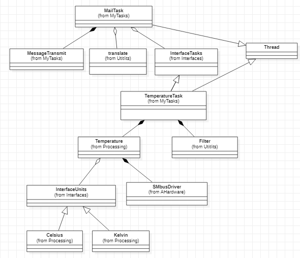

== Детальная архитектура проекта

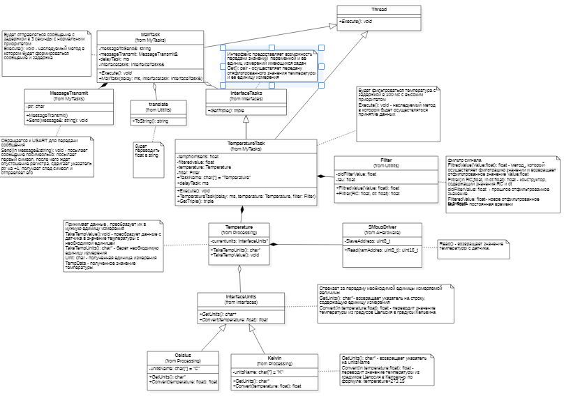

= Описание классов

== Классы Celsius и Kelvin

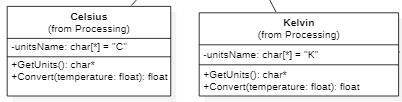

GetUnits(): char* - возвращает указатель на unitsName

Convert(in temperature:float): float - переводит значение температуры из градумов Цельсия в Кельвины по формуле:
temperature+273.15

=== Код классов Celsius и Kelvin

celsius.cpp

[source, c++]
#include "celsius.h"
const char* Celsius::GetUnits() const
{
return (char*)unitsName;
}
float Celsius::Convert( float temperature) const
{
return temperature;
}

celsius.h

[source, c++]
#pragma once
#include "interfaceunits.h"
class Celsius: public InterfaceUnits
{
public:
const char* GetUnits() const override;
float Convert(float temperature) const override;
private:
const char* unitsName = "C";
};
inline Celsius celsius;

kelvin.cpp

[source, c++]
#include "kelvin.h"
const char* Kelvin::GetUnits() const
{
return (char*)unitsName;
}
float Kelvin::Convert( float temperature) const
{
temperature  = temperature+273.15;
return temperature;
}

kelvin.h

[source, c++]
#pragma once
#include "interfaceunits.h"
class Kelvin: public InterfaceUnits
{
public:
const char* GetUnits() const override;
float Convert(float temperature) const override;
private:
const char* unitsName = "K";
};
inline Kelvin kelvin;

== Класс InterfaceUnits

Отвечает за передачу необходимой единицы измеряемой величины.

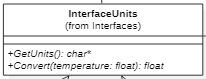

GetUnits(): char*- возвращает указатель на строку, содержащую единицу измерения.

Convert(temperature:float): float - переводит значение температуры из градусов Цельсия в градусы Кельвина.

=== Код класса InterfaceUnits

interfaceunits.h
[source, c++]
#pragma once
class InterfaceUnits
{
public:
virtual const char* GetUnits() const;
virtual  float Convert(float temperature) const;
};

== Класс SMbusDriver

SMBus (System Management Bus) — последовательный протокол обмена данными для устройств питания.

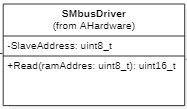

Read() - возвращает значение температуры с датчика.

=== Код класса InterfaceUnits

smbusdriver.h
[source, c++]
#pragma once
#include "thread.hpp"
#include "smbusdriver.h"
#include "i2c1registers.hpp" //for I2C1
class SMBusDriver
{
public:
 float Read(uint8_t address)
  {
    I2C1::CR1::START::Enable::Set();
    while(I2C1::SR1::SB::Value0::IsSet())
    {
    }
    I2C1::SR1::Get();
    I2C1::CR1::ACK::Acknowledge::Set() ;
    I2C1::DR::Write(SlaveAddress);
    while(I2C1::SR1::ADDR::Value0::IsSet())
    {
    }
    I2C1::SR1::Get();
    I2C1::SR2::Get();
    I2C1::DR::Write(address);
    while(I2C1::SR1::TxE::Value0::IsSet())
    {
    }
    I2C1::CR1::START::Enable::Set();
    while(I2C1::SR1::SB::Value0::IsSet())
    {
    }
    I2C1::DR::Write(AddressToSend);
    while(I2C1::SR1::ADDR::Value0::IsSet())
    {
    }
    I2C1::CR1::ACK::NoAcknowledge::Set() ;
    I2C1::CR1::POS::NextByte::Set();
    I2C1::SR1::Get();
    I2C1::SR2::Get();
    while (I2C1::SR1::BTF::Value0::IsSet())
    {
    }
    I2C1::CR1::STOP::Enable::Set();
    uint16_t value = I2C1::DR::Get();
    value = value + (I2C1::DR::Get()<<8);
    float valueC = value*0.02F - 273.15F;
    return valueC;
  }
 private:
uint8_t SlaveAddress =0x00;
uint8_t  AddressToSend =0x01;
};

== Класс Temperature

Принимает данные, преобразует их в нужную единицу измерения.

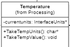

TakeTempValue():void - преобразует данные с датчика в значение температуры с необходимой единицей.

TakeTempUnits(): char* - берет необходимую единицу измерения.

Unit: char - полученная единица измерения.

TempData - полученное значение температуры.

=== Код класса Temperature

temperature.cpp
[source, c++]
#include "temperature.h"
#include "interfaceunits.h"
#include "smbusdriver.h"
#include "kelvin.h"
const char* Temperature::TakeTempUnits() const
{
const char* result = &NoUnits[0];
   if(currentunits != nullptr)
   {
   result =  currentunits->GetUnits();
   }
   return result;
  }
  float Temperature::TakeTempValue()
  {
    temperature  = smbus.Read(0x07);
    return currentunits -> Convert(temperature);
  }

temperature.h
[source, c++]
#pragma once
#include "interfaceunits.h"
#include "smbusdriver.h"
class Temperature
{
public:
const char* TakeTempUnits() const;
float TakeTempValue();
void SetCurrentUnits(InterfaceUnits* units)
{
currentunits = units;
}
 private:
  SMBusDriver smbus;
  InterfaceUnits* currentunits = nullptr;
  float temperature;
  const char NoUnits[8] = "NoUnits";
};

== Класс Filter

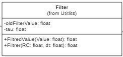

FiltredValue(Value:float): float - метод , который осуществляет фильтрацию значений и возвращает отфильтрованное значение Value:float.

Filtrer(in RC:float, in dt:float): float - конструктор, содержащий значения RC и dt.

oldFilterValue: float - прошлое отфильтрованное значение.

FilteredValue: float - новое отфильтрованное значение.

tau: float - постоянная времени.

=== Код класса Filter

filter.cpp
[source, c++]
#include "filter.h"
#include <math.h>
Filter::Filter(float RC, float dt)
  {
    tau = 1 - exp(-dt/RC);
  }
float Filter::FiltredValue(float Value)
{
FilteredValue = oldFilterValue + (Value - oldFilterValue) * tau;
oldFilterValue = FilteredValue;
return FilteredValue;
}

filter.h
[source, c++]
#pragma once
#include <chrono> // for 'ms' literal
class Filter
{
public:
   float FiltredValue(float Value);
   Filter(float RC, float dt);
 private:
   float oldFilterValue;
   float tau;
   float FilteredValue;
};

== Класс TemperatureTask

Будет фильтроваться температура с задержкой в 100 мс с высоким приоритетом.

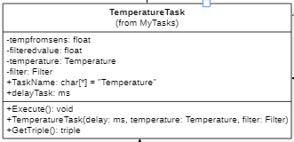

Execute(): void - наследуемый метод в котором будет осуществляться принятие данных.

=== Код класса TemperatureTask

temperaturetask.cpp
[source, c++]
#include "temperaturetask.h"
#include "temperature.h"
#include "filter.h"
#include "interfacetasks.h"
#include "kelvin.h" // for Kelvin
#include "celsius.h" // for Kelvin
TemperatureTask::TemperatureTask(std::chrono::milliseconds delay,Temperature& temperature,  Filter& filter): delayTask(delay), temperature(temperature), filter(filter), InterfaceTasks()
{
temperature.SetCurrentUnits(&celsius);
Triple.TaskName = "Temperature: ";
}
void TemperatureTask::Execute()
{
for(;;)
{
tempfromsens = temperature.TakeTempValue();
filteredvalue = filter.FiltredValue(tempfromsens);
     Triple.Value = filteredvalue;
     Triple.Unit =  temperature.TakeTempUnits();
     Sleep(delayTask);
    }
  }
  triple TemperatureTask::GetTriple() const
  {
    return Triple;
  }

temperaturetask.h
[source, c++]
#pragma once
#include "temperature.h"
#include "filter.h"
#include "interfacetasks.h"
class TemperatureTask: public OsWrapper::Thread<512>, public InterfaceTasks
{
public:
TemperatureTask(std::chrono::milliseconds delay, Temperature& temperature, Filter& filter);
void Execute() override;
triple GetTriple() const override;
private:
triple Triple;
Temperature& temperature;
float filteredvalue;
float tempfromsens;
Filter& filter;
std::chrono::milliseconds delayTask;
};

== Класс InterfaceTasks

Интерфейс предоставляет возможность передачи значений  переменной и ее единиц измерений имеющихся задач.

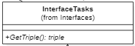

Get(): pair - осуществляет передачу отяфльтрованного значения температуры и ее единицу измерения.

=== Код класса InterfaceTasks

interfacetasks.cpp
[source, c++]
#include "interfacetasks.h"
InterfaceTasks::InterfaceTasks()
{
}

interfacetasks.h
[source, c++]
#pragma once
typedef struct
{
float Value;
const char* Unit;
const char* TaskName;
} triple;
class InterfaceTasks
{
public:
virtual triple GetTriple() const =0;
InterfaceTasks();
};

== Класс translate

Переводит float в sting.

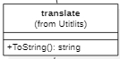

=== Код класса InterfaceTasks

translate.cpp
[source, c++]
#include "translate.h"
#include <string> // for std::string
#include <iostream>
#include <sstream>
#include <iomanip>
Translate::Translate()
  {
  }
 std::string Translate::ToString(float Value,const char* Units, const char* TaskName)
 {
   resault = std::to_string(Value);
   resault.insert(0, TaskName);
   resault.append(" ");
   resault.append(Units);
   resault.append("    ");
   return resault;
 }

translate.h
[source, c++]
#pragma once
#include "interfacetasks.h"
#include <string> // for std::string
class Translate
{
public:
std::string ToString(float Value, const char* Units, const char* TaskName);
Translate();
 private:
 std::string resault;
 std::string resaultout;
};

== Класс MessageTransmit

Обращается к USART для передачи сообщения.

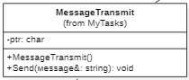

Send(in мessage&:string): void - посылает сообщение посимвольно: посылает первый символ,
после чего ждет опустошение регистра, сдвигает указатель ptr на +1,
получает след символ и отправляет его.

=== Код класса MessageTransmit

messagetransmit.cpp
[source, c++]
#include "messagetransmit.h"
#include "usart2registers.hpp" //for USART2
#include <array>
#include <string>
#include "rtos.hpp"         // for Rtos
#include "mutex.hpp" // for Mutex
extern  OsWrapper::Mutex USARTMutex;
void MessageTransmit::Send(std::string& message) // Ïåðåäà÷à ññûëêè íà ñîîáùåíèå
{
while(*ptr != 0)
{
USART2::DR::Write(*ptr);
    while(USART2::SR::TXE::DataRegisterNotEmpty::IsSet())
    {
    }
     ptr++;
}
    if(*ptr == 0)
    {
      ptr= message.c_str();
   }
 }

messagetransmit.h
[source, c++]
#pragma once
#include <array>
#include <string>
//template <TUSART>
class MessageTransmit
{
public:
void Send(std::string& message);
 MessageTransmit() = default;
private:
 std::string& MessageToSend;
 const char  *ptr;
};

== Класс MailTask

Отправляет сообщение с задержкой в 3 секунды с нормальным приоритетом.

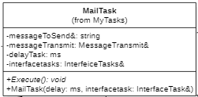

Execute(): void - наследуемый метод в котором будет формироваться сообщение и задержка.

=== Код класса MailTask

mailtask.cpp
[source, c++]
#include "mailtask.h"
#include "messagetransmit.h"
#include "interfacetasks.h"
#include <array>
#include <string>
MailTask::MailTask(std::chrono::milliseconds delay, InterfaceTasks* value) : delayTask(delay), ValueUnit(value)
{
}
void MailTask::Execute()
{
  for(;;)
  {
    Triple =  ValueUnit -> GetTriple();
    messageToSend = translate.ToString(Triple.Value, Triple.Unit, Triple.TaskName);
    messageTransmit.Send(messageToSend);
    Sleep(delayTask);
  }
}

mailtask.h
[source, c++]
#pragma once
#include "messagetransmit.h"
#include "thread.hpp"
#include "translate.h"
#include "interfacetasks.h"
#include <string> // for std::string
#include <chrono> // for std::chrono::miliseconds
class MailTask : public OsWrapper::Thread<200>
{
public:
MailTask(std::chrono::milliseconds delay, InterfaceTasks* value );
void Execute() override;
private:
std::string messageToSend;
std::chrono::milliseconds delayTask;
Translate translate;
InterfaceTasks* ValueUnit = nullptr;
MessageTransmit messageTransmit;
//TemperatureTask& temperatureTask;
triple Triple;
};

== Main.cpp

[source, c++]
#include "rtos.hpp"         // for Rtos
#include "mailbox.hpp"      // for Mailbox
#include "event.hpp"        // for Event
#include "mailtask.h"
#include "messagetransmit.h"
#include "rccregisters.hpp" // for RCC
#include "usart2registers.hpp" //for USART2
#include "buttontask.h" // for MyFirstTask
#include "Application/Diagnostic/GlobalStatus.hpp"
#include <gpioaregisters.hpp>  // for GPIOA
#include <gpiobregisters.hpp>   // for GPIOB
#include <gpiocregisters.hpp>  // for GPIOC
#include "i2c1registers.hpp" //for I2C1
#include "smbusdriver.h"
#include "filter.h"
#include "temperaturetask.h"
#include "temperature.h"
#include <string>
#include <messagetransmit.h>
std::uint32_t SystemCoreClock = 16'000'000U;
extern "C" {
int __low_level_init(void)
{
//Switch on external 16 MHz oscillator
RCC::CR::HSION::On::Set();
while (RCC::CR::HSIRDY::NotReady::IsSet())
{
  }
  //Switch system clock on external oscillator
  RCC::CFGR::SW::Hsi::Set();
  while (!RCC::CFGR::SWS::Hsi::IsSet())
 {
  }
  >::Set();
   RCC::APB2ENR::SYSCFGEN::Enable::Set();
   GPIOA::MODER::MODER2::Alternate::Set();
   GPIOA::MODER::MODER3::Alternate::Set();
   GPIOA::AFRL::AFRL2::Af7::Set(); //Tx usart2
   GPIOA::AFRL::AFRL3::Af7::Set(); //Rx usart2
   RCC::APB1ENR::USART2EN::Enable::Set();
   USART2::CR1::OVER8::OversamplingBy16::Set();
   USART2::CR1::M::Data8bits::Set();
   USART2::CR1::PCE::ParityControlDisable::Set();
   USART2::BRR::Write(16'000'000/(9600));
   USART2::CR1::UE::Enable::Set();
//SMBus
RCC::APB1ENR::I2C1EN::Enable::Set();
I2C1::CR1::SMBUS::SmBusMode::Set();
I2C1::CR1::SMBTYPE::Device::Set();
I2C1::CCR::F_S::StandartMode::Set();
I2C1::CCR::CCR::Set(0xFA);
I2C1::CR2::FREQ::Set(0x10);
I2C1::TRISE::Write(0x11);
I2C1::CR1::PE::Enable::Set();
I2C1::OAR1::ADDMODE::Bits7::Set();
GPIOB::MODER::MODER8::Alternate::Set(); //Alternate moder 8
GPIOB::MODER::MODER9::Alternate::Set(); //Alternate moder 9
GPIOB::AFRH::AFRH8::Af4::Set();  //scl
GPIOB::AFRH::AFRH9::Af4::Set();  //sda
GPIOB::OTYPER::OT8::OutputOpenDrain::Set();
GPIOB::OTYPER::OT9::OutputOpenDrain::Set();
GPIOB::PUPDR::PUPDR8::PullUp::Set();
GPIOB::PUPDR::PUPDR9::PullUp::Set();
  return 1;
}
}
Filter filter(1.0F,0.1F);
Temperature temperature;
TemperatureTask temperatureTask(100ms,temperature,filter);
MailTask mailTask1(3000ms, &temperatureTask);
int main()
{
  USART2::CR1::TE::Enable::Set();
  using namespace OsWrapper;
  Rtos::CreateThread(temperatureTask, "TemperatureTask", ThreadPriority::highest);
  Rtos::CreateThread(mailTask1, "MailTask", ThreadPriority::normal);
  Rtos::Start();
  return 0;
}

= Результат работы программы

Результаты в градусах Цельсия, снятые с датчика при RC = 9 фильтра

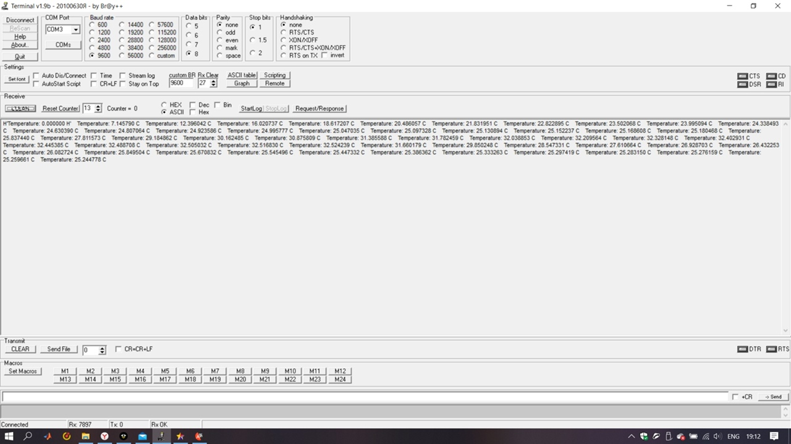

Результаты в градусах Цельсия, снятые с датчика при RC = 1 фильтра

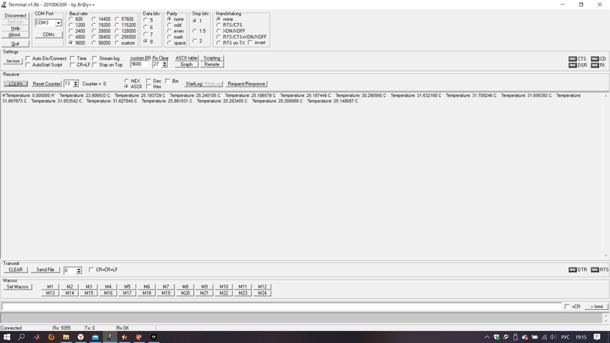

Результаты в градусах Кельвина, снятые с датчика при RC = 1 фильтра

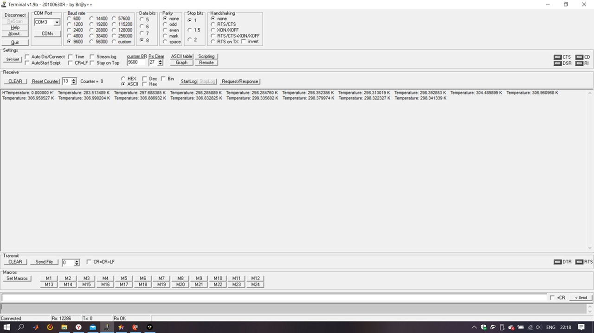

= Заключение

В ходе работы над курсовым проектом было разработано датчика бесконтактного измерения температуры MLX90614 с передачей параметров USART.
Вывод результатов измерения производится в Терминал.
