:toc:
:toc-title: ОГЛАВЛЕНИЕ:

== Инфракрасный датчик температуры

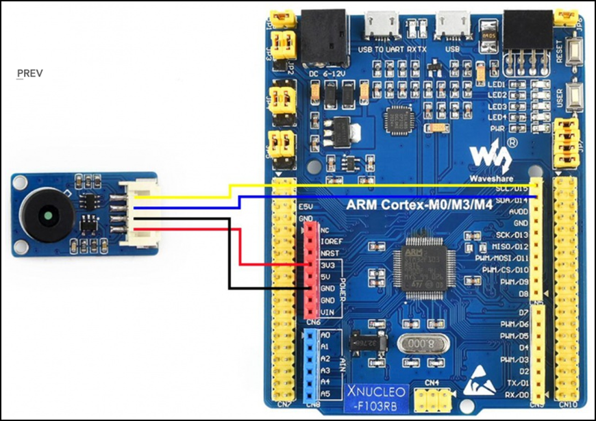

=== Принцип измерения
Для бесконтактного инфракрасного модуля измерения температуры поле зрения (FOV) является очень важным понятием.
FOV определяется 50% сигналом излучения, принимаемым термоэлектрической батареей. И это связано с осью шпинделя датчика.
Обнаруженная температура представляет собой средневзвешенное значение температуры объекта, обнаруженной в FOV.
Таким образом, значение является наиболее правильным, пока объект покрывает весь FOV.

=== Характеристики
* Мощность: 3,3 В ~ 5 В.
* Диапазон измерения (площадь): 40°C ~ 85°C.
* Диапазон измерения (объект): -70°C ~ 380°C.
* Разрешение: 0,02°C.
* Точность: ±0,5°C (0~50°C).

=== РАСПИНОВКА
|====

|PIN |Описание
|VCC
|3,3 В/5 В
|GND
|Земля
|SDA
|Ввод данных I2C
|SCL
|Тактовый контакт I2C
|====

=== Протокол связи
Этот датчик имеет цифровой выход PWM и SMBus (шина управления системой). В этом документе мы вводим только связь SMBus. SMBus – это двухпроводной интерфейс, основанный на принципе I2C.
Стартовый сигнал: SCL имеет ВЫСОКИЙ уровень, SDA переключается с ВЫСОКОГО на НИЗКИЙ, начинается передача данных.

Сигнал остановки: SCL имеет высокий уровень, SDA переходит от низкого уровня к высокому, передача завершена.

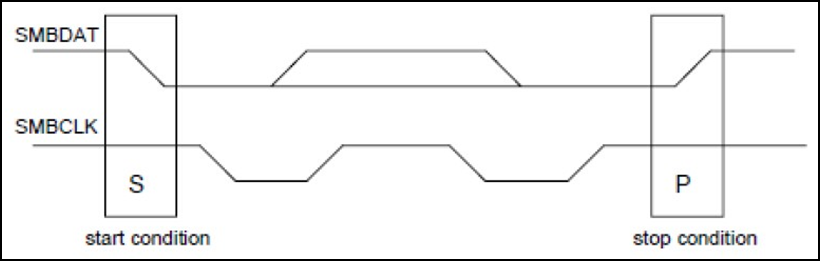

ACK: Каждый раз, когда Master (Slave) получает 8-битные данные от Slave (Master), он отправляет ACK обратно отправителю, чтобы сообщить, что данные были успешно переданы, удерживая SDA неактивным в течение всего периода SCL.

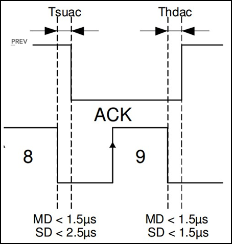
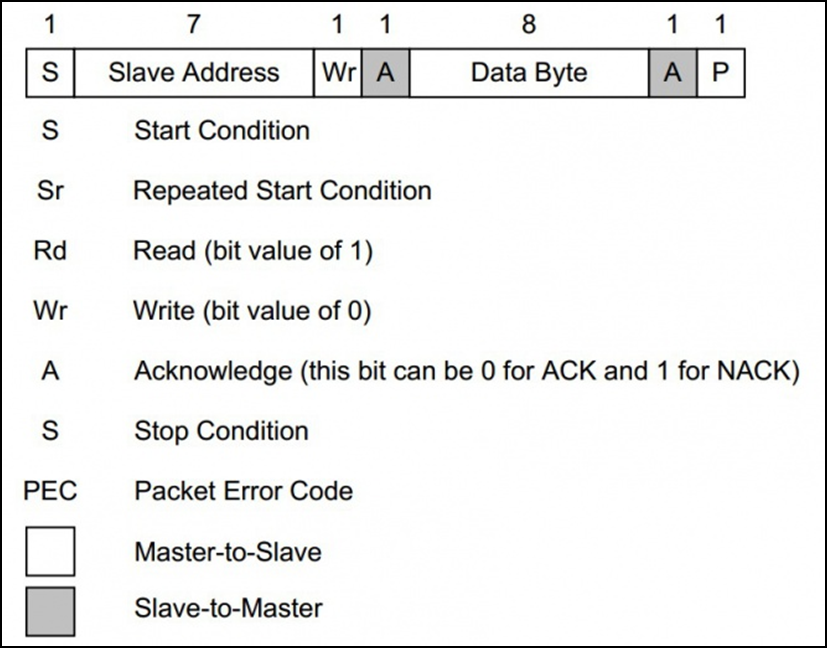

== Интерфейс SMBus

=== Чтение времени SMBus

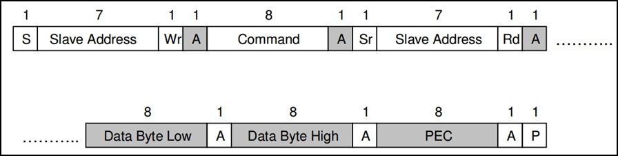

=== Время записи SMBus

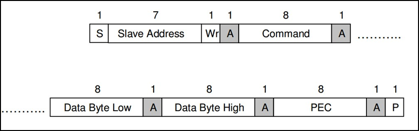

=== Настройка I2C

1. Подача тактирования I2C:
Установка бита I2С в регистре АРВ1.

[source, c++]
RCC::APB1ENR::I2C1EN::Enable::Set();

2.	Включаем режим SMBus CR1.
В модуле I2C
Бит 1 SMBUS: режим SMBus
0: режим I2C
1: режим SMBus

3.	Включаем распознавания устройства SMBus
Бит 3 SMBTYPE: Тип SMBus.

0: Устройство SMBus

1: SMBus Host

SMBus Адрес устройства по умолчанию распознается, если SMBTYPE=0

Адрес хоста SMBus распознается, если SMBTYPE=1

4.	Подключаем Standartmodдля установления частоты 2 МГц

Бит 15 F/S: I2C master mode selection.

0: Sm mode I2C.

1: Fm mode I2C.

5.	Выставляем частоту периферийного устройстваI2C_CR2

Биты 5:0 FREQ[5:0]: Тактовая частота периферийного устройства.

Выбирается на основе доступных частот ИК датчика 0b010000: 16МГц.

6.	Настройка регистра таймеров I2C_CCR

Бит 15 устанавливается в 0, т.к. не выполняется отношение Tlow к Thigh как 1/2.

Из DataSheet по ИК датчику MLX90614 можно определить Thigh=45..55мкси Tlow=27..33 мс.

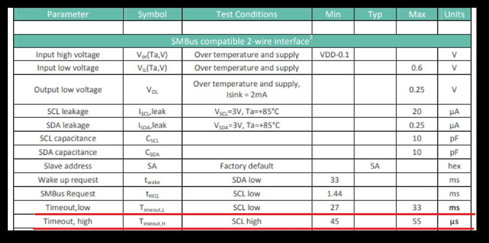

Бит 11 регистр тайминга CCR.

TPCLK1 – период APB1, получаемый по формуле 1/f, где f=16MHz.

TPCLK1=0,0625мкс.

Используя формулу:

И, взяв Thigh=50, определим CCR= 250(FA).

Tlow= 9 мс.

7.	Выставляем бит макс нарастанияI2C_TRISE

TRISE [5:0]: Максимальное время нарастания в режиме Fm/Sm (режим ведущего устройства).

Эти биты должны обеспечивать максимальную длительность петли обратной связи SCL в режиме ведущего устройства.

Так как особых требований нет возьмём SCLhigh = 1000 нс.
Используя формулу:

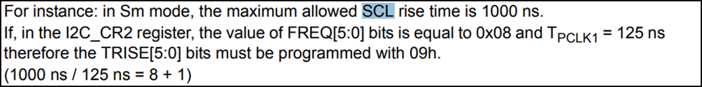

1/0,0625=16+1, тогда TRISE 11h.

8.	Настройка портов
Для корректной работы интерфейсови портов переведём B8 (SCL), B9 (SDA) в альтернативный режим.

[source, c++]
GPIOB::MODER::MODER8::Alternate::Set();
GPIOB::MODER::MODER9::Alternate::Set();

Установим альтернативные функции регистраAFRHSCLиSDA:

[source, c++]
GPIOB::AFRH::AFRH8::Af4::Set();
GPIOB::AFRH::AFRH9::Af4::Set();

В регистре OTYPER, отвечающем за выводы, настроим портыB8и B9используя команду OutputOpenDrain.
Выход с открытым стоком. Функционально аналогичен выходу с открытым коллектором.
При низком логическом уровне замыкает вывод на землю, при высоком – бросает в воздухе.

[source, c++]
GPIOB::OTYPER::OT8::OutputOpenDrain::Set();
GPIOB::OTYPER::OT9::OutputOpenDrain::Set();

Установим подтяжку к единице на B8, B9 портах, т.к. без неё будет разрыв.

[source, c++]
GPIOB::PUPDR::PUPDR8::PullUp::Set() ;
GPIOB::PUPDR::PUPDR9::PullUp::Set() ;

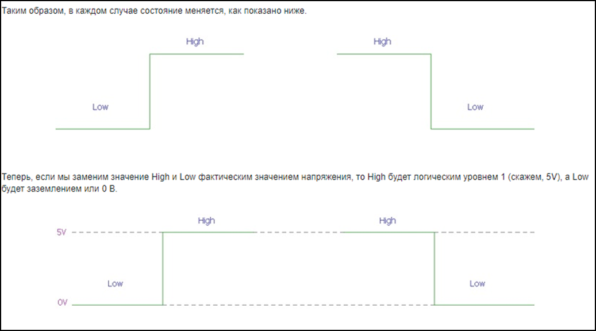

9.	Генерируем старт

10.	Алгоритм считывания
Инициация передачи I2C:

[source, c++]
I2C1::CR1::START::Enable::Set();

Проверить бит SB пока он не станет = 1 (установился ли стартовый бит).

[source, c++]
while(I2C1::SR1::SB::Value0::IsSet())
{
}

Получение данных с регистра SR1.

[source, c++]
I2C1::SR1::Get();

Включение ACK (бит подтверждения – если мастер записывает в SLAVE, то SLAVE долженкаждый
байт подтверждать сигналом ACK. Если слейв отправляет данные мастеру,
то мастер должен на все байты отвечать ACK, кроме последнего — это будет сигналом,
что больше отправлять данные не требуется) для модуляI2C.

Данный бит необходимо установить сразу. Что бы принять ответ от подчинённого устройства.

[source, c++]
I2C1::CR1::ACK::Acknowledge::Set();

I2C_DR нужен для отправки данных и их приёма,
туда передаётся адрес устройства (ИК-датчика) (0 если запись, 1 если чтение).

[source, c++]
I2C1::DR::Write(0x00);

Дождаться бита ADDR (адрес отправлен и воспринят slave-устройством) в SR1, пока не станет =1.

[source, c++]
while(I2C1::SR1::ADDR::Value0::IsSet())
{
}

Получение данных с регистра SR1, SR2.

[source, c++]
I2C1::SR1::Get();
I2C1::SR2::Get();

Далее необходимо записать адрес регистра, в котором хранятся значения температуры.

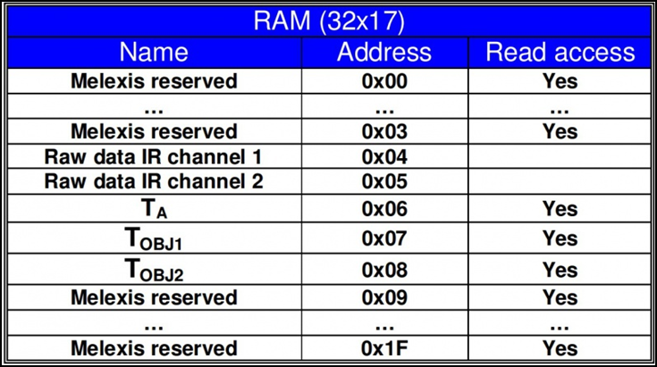

[source, c++]
I2C1::DR::Write(0x07);

Дождаться установки бита ТхЕ (буфер свободен для внесения данных для последующей передачи).

[source, c++]
while(I2C1::SR1::TxE::Value0::IsSet())
{
}

Повторный запуск

[source, c++]
I2C1::CR1::START::Enable::Set();

Проверить бит SB пока он не станет = 1.

[source, c++]
while(I2C1::SR1::SB::Value0::IsSet())
{
}

Считываем с регистра информацию

[source, c++]
I2C1::DR::Write(0x01);

Дождаться бита ADDR в SR1, пока не станет =1.

[source, c++]
while(I2C1::SR1::ADDR::Value0::IsSet())
{
}

Отключение бита ACK.

[source, c++]
I2C1::CR1::ACK::NoAcknowledge::Set();

Включение POS, чтобы проверить посылку на ошибки.

[source, c++]
I2C1::CR1::POS::NextByte::Set();

Для скидывания ADDR необходимо получить данные с регистровSR1иSR2

[source, c++]
I2C1::SR1::Get();
I2C1::SR2::Get();

Завершение передачи.

[source, c++]
while (I2C1::SR1::BTF::Value0::IsSet())
{
}

Остановка I2C.

[source, c++]
I2C1::CR1::STOP::Enable::Set();

Из регистра DR 2 раза прочитать байты.

[source, c++]
I2C::DR::Get(); // байт 1
I2C::DR::Get(); // байт 2

=== Архитектура класса SMbusDriver

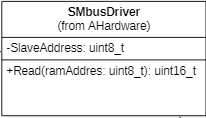

Read() - возвращает значение температуры с датчика.

== Интерфейс USART2

=== Особенности USART
UASRT STM микроконтроллера очень обширный, но мы рассмотрим только то, что относится к UART
В модуле USART можно настраивать следующие параметры:

* Скорость обмена до 4 мбит/c.
* Контроль четности.
* 1 или 2 стоповых битов.
* 8 или 9 бит данных.
* Запросы на детектирование ошибок приемо-передачи.
* Прерывания по приему, передачи, ошибкам передачи.
Для настройки и работы модуля UART нужны всего несколько регистров.

* USART_CR1/CR2/CR3 – регистр настройки 1.
* USART_DR – регистр принятого символа (регистр данных).
* USART_BRR – регистр настройки скорости передачи.
* USART_SR – регистр состояния.

=== Порядок запуска модуля USART
* Подключить USART к источнику тактирования – устанавливаем бит USART2EN в регистре APB1ENR (АЦП тактируется от матрицы шин APB1).
* Необходимо сконфигурировать порты. Настроить порты, на альтернативную функцию нужного модуля USART
* Настроить формат передачи байт, с помощью регистра CR1 и CR2
* Задать скорость передачи с помощью регистра BRR
* Разрешить передачу помощью бита TE и если надо прием, с помощью бита RE в модуле USART с помощью регистра CR1
* Включить сам модуль USART битом UE в регистре CR1

== Операционная Система Реального Времени FreeRTOS
ОСРВ предназначены для обеспечения интерфейса к ресурсам критических по времени системах является своевременность (timeless) выполнения обработки данных.
Задачей ОСРВ является обеспечение реакции на определенное действие за отведенный квант времени. Для разных задач квант может иметь разное значение.
Время реакции системы на события - интервал времени от события на объекте и до выполнения первой инструкции в программе обработки этого события. Интервал времени определяется свойствами операционной системы и архитектурой микроконтроллера.
ОСРВ упрощают разработку той программы, где необходимо паралельно обрабатывать множество действий, в том числе можно без особого труда добавить дополнительные, что позволяет расширить программу, однако в слишком тривиальных задачах она лишь дополнительно усложнит задачу.
ОСРВ обеспечивает многозадачность (или псевдомногозадачность).
Существует 2 версии многозадачности:

1. "Мягкого" реального времени программа либо выполняется за определенное время либо нет.
2.	"Жесткого" реального времени - каждая задача должна выполняться за отведенный квант времени, невыполнение ведет к краху системы.
В ОСРВ используются задачи, которые вызываются планировщиком каждый раз по прерыванию системного таймера либо при непосредственном вызове планировщика.
Каждый раз планировщик пробегается по списку задач выбирает задачу готовую к работе.
В кооперативной многозадачности планировщик смотрит завершена ли текущая зада и готова ли задача с большим приоритетом. В вытесняющем режиме планировщик лишь смотрит готовую задачу в большим приоритетом и в случае чего прерывает менее приоритетную.
Один из таймеров микроконтроллера настраивают на генерацию системных "тиков" - вызовов прерывания таймера в котором вызывается планировщик.

Free RTOS – бесплатная многозадачная операционная система реального времени для встраиваемых систем. Планировщик системы простой, но при этом позволяет задать приоритеты процессов, вытесняющую и невытесняющую многозадачность, очереди.
Задача – это подпрогамма, которая имеет свою точку входа, и исполняется внутри бесконечного цикла, Имеет собственный приоритет, стек, идентификатор. Задача может находить в нескольких состояниях и переходить в одно из другого.

== Фильтр

Входной сигнал необходимо будет отфильтровать с помощью фильтра с бесконечно-импульсной характеристикой БИХ. На рисунке ниже представлены требования к нему.

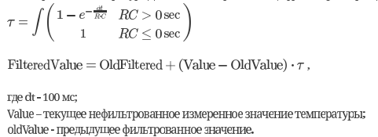

Время дискретизации фильтра совпадает с временем получения новых значений сигнала.

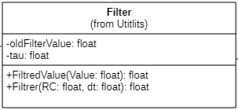

FiltredValue(Value:float): float - метод , который осуществляет фильтрацию значений и возвращает отфильтрованное значение Value:float.

Filtrer(in RC:float, in dt:float): float - конструктор, содержащий значения RC и dt.

oldFilterValue: float  - прошлое отфильтрованное значение.

FilteredValue: float- новое отфильтрованное значение.

tau: float - постоянная времени.

== Питание

Питание будет осуществляться с помощью солнечной батареи, поскольку питание будет нестабильно, необходимо будет уменьшить частоту процессора.

